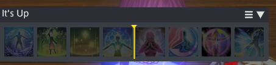
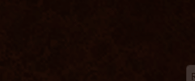
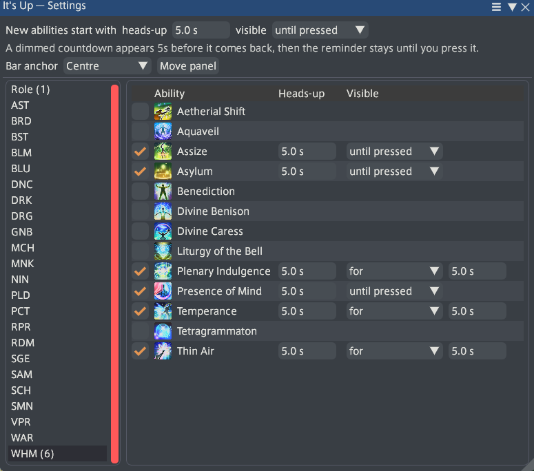

# It's Up


<p align="center"></p>

<p align="center"><i>Yes. Still up. Press it.</i></p>


A cooldown reminder for FFXIV. It stays empty until you use something — then, once it's back up,
its icon appears. Press it, and it's gone again.

Raiding already has your attention on mechanics, so it's easy to lose track of a cooldown coming
back mid-fight. This doesn't call your opener or your rotation — it just reminds you when
something you've already used is up again. When to use it is still entirely up to you.

<p align="center"><br><i>Position the bar</i></p>


<p align="center"><br><i>A icon counts down just before an ability returns</i></p>

## Install

Add this as a custom plugin repository (`/xlsettings` → **Experimental** → **Custom Plugin
Repositories**):

```
https://github.com/juan-medina/ItsUp/releases/latest/download/repo.json
```

Then install **It's Up** from `/xlplugins`.

## Use

- `/itsup config` — pick which abilities to track
- `/itsup` — unlock the panel to drag it into place

Everything else — filters, timing meanings, bar positioning — is explained in the settings
window itself.

<p align="center"></p>

